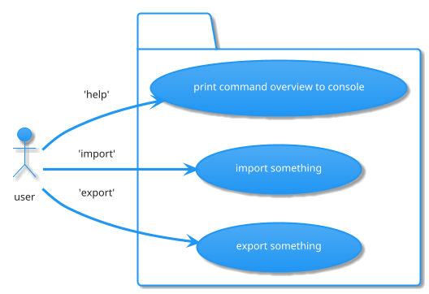
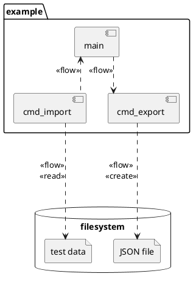
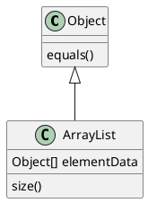
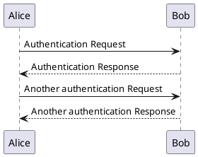

# Software Architecture

The following section describes the high level software architecture

## Use Cases

```plantuml
@startuml
!theme materia
left to right direction

actor user as user

package Usescases{
    usecase UC_help as "print command overview to console"
    usecase UC_import as "import something"
    usecase UC_export as "export something"
}

user --> UC_help : 'help'
user --> UC_import : 'import'
user --> UC_export : 'export'
@enduml
```

## Context Diagram

```plantuml
@startuml
top to bottom direction
skinparam Linetype ortho


package "example"{
    [main] as main
    [cmd_import] as import
    [cmd_export] as export
}

database filesystem {
    file "test data" as test_data
    file "JSON file" as file
}

main <.down. import : <<flow>>
main .down.> export : <<flow>>
 
export ...down.> file       : <<flow>>\n<<create>>
import ....> test_data : <<flow>>\n<<read>>
@enduml
```

## Class Diagram

```plantuml
@startuml
Object <|-- ArrayList

Object : equals()
ArrayList : Object[] elementData
ArrayList : size()

@enduml

```

## Sequence Diagram

```plantuml
@startuml
Alice -> Bob: Authentication Request
Bob --> Alice: Authentication Response

Alice -> Bob: Another authentication Request
Alice <-- Bob: Another authentication Response
@enduml

```
